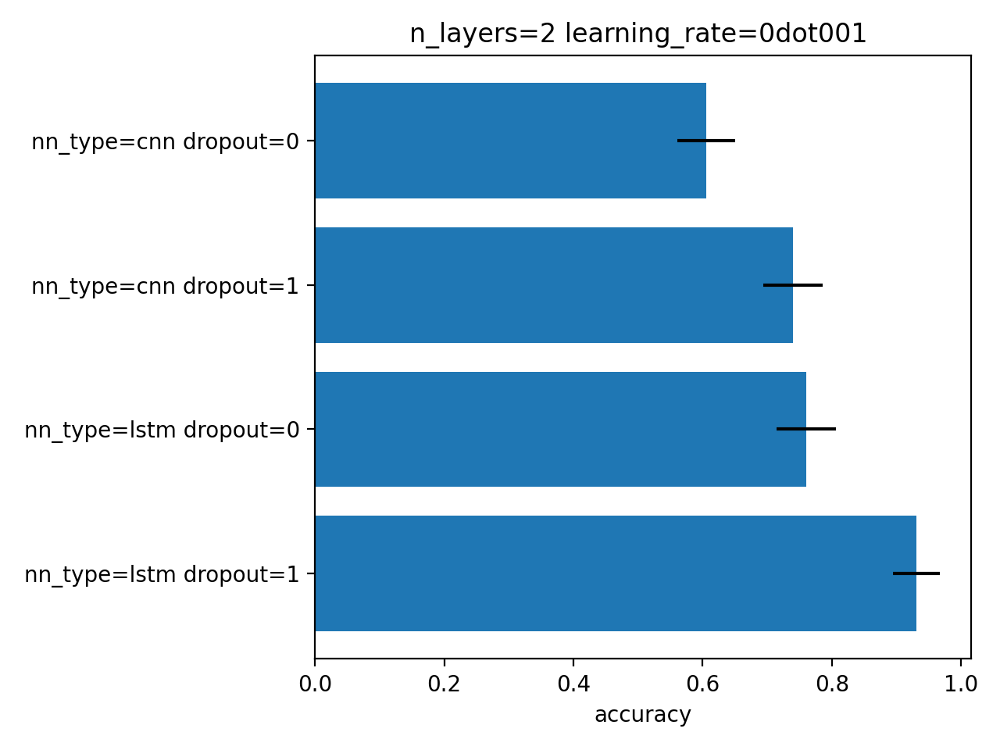

Tutorial
^^^^^^^^

This section covers the fundamentals of developing with *doce*, including
a package overview, basic and advanced usage.  We will assume basic familiarity with Python and NumPy.

Overview
~~~~~~~~

The *doce* package is structured as collection of submodules that are each responsible for the important parts of managing a computational experiment:

  - :ref:`doce.cli <cli>`
      Command-line interaction.
  - :ref:`doce.experiment <experiment>`
      Specify every aspects of the experiments from naming, storage location, plan, etc...
  - :ref:`doce.plan <plan>`
      Generate a number of settings by selecting factors and modalities of a given plan.
  - :ref:`doce.setting <setting>`
      Manipulate the settings generated by the plan.
  - :ref:`doce.metric <metric>`
      Manipulate and retrieve the output data.
  - :ref:`doce.util <util>`
      Utility functions.

.. _quickstart:

Quickstart
~~~~~~~~~~

The *doce* package is designed to require very few lines of code around your processing code to handle the task of evaluating its performance with respect to different parametrizations.

Define the experiment
=====================

In a .py file, ideally named after the name of your experiment, you have to implement a *set* function that contains the relevant definition of your experiment. The demonstrations discussed in this tutorial are available in the examples_ directory of the github repository of the project. In this first example, the demo.py_ is considered.

.. _examples: https://github.com/mathieulagrange/doce/tree/main/examples

.. _demo.py: https://github.com/mathieulagrange/doce/tree/main/examples/demo.py

.. code-block:: python
    :linenos:

    # define the doce environnment
    def set(args):
      # define the experiment
      experiment = doce.Experiment(
        name = 'demo',
        purpose = 'hello world of the doce package',
        author = 'mathieu Lagrange',
        address = 'mathieu.lagrange@ls2n.fr',
      )
      # set acces paths (here only storage is needed)
      experiment.setPath('output', '/tmp/'+experiment.name+'/')
      # set some non varying parameters (here the number of cross validation folds)
      experiment.n_cross_validation_folds = 10

      return experiment

Define the plan
===============

In *doce*, the parametrization of the processing code is called a *setting*. Each setting is a set of *factors*, each factor being uniquely instantiated by a *modality*, chosen among a pre-defined set of modalities.

.. code-block:: python
    :linenos:

    def set(args):
      ...
      # set the plan (factor : modalities)
      experiment.addPlan('plan',
        nn_type = ['cnn', 'lstm'],
        n_layers = np.arange(2, 10, 3),
        learning_rate = [0.001, 0.0001],
        dropout = [0, 1]
      )
      ...

Interact with your experiment
=============================

The *doce* package have a convenient way of interacting with experiments, through the command-line. For this to work, you need to add those lines to your python file:

.. code-block:: python
    :linenos:

    # invoke the command line management of the doce package
    if __name__ == "__main__":
      doce.cli.main()

Now you can interact with your experiment. For example you can display the plan:

.. code-block:: console

  $ python demo.py -p
           Factors      0       1  2
  0        nn_type    cnn    lstm
  1       n_layers      2       5  8
  2  learning_rate  0.001  0.0001  0.00001
  3        dropout      0       1

You can also access to a reference list of each pre-defined argument:

.. code-block:: console

  $ python demo.py -h
  usage: demo.py [-h] [-A [ARCHIVE]] [-C] [-d [DISPLAY]] [-E [EXPORT]] [-H HOST] [-i] [-K [KEEP]] [-l]
                 [-M [MAIL]] [-p] [-P [PROGRESS]] [-r [RUN]] [-R [REMOVE]] [-s SELECT] [-S] [-u USERDATA]
                 [-v] [-V]

  optional arguments:
    -h, --help            show this help message and exit
  ...

Control the plan
================

You can list the different settings generated by the plan:

.. code-block:: console

  $ python demo.py -l
  nn_type=cnn+n_layers=2+learning_rate=0dot001+dropout=0
  nn_type=cnn+n_layers=2+learning_rate=0dot001+dropout=1
  nn_type=cnn+n_layers=2+learning_rate=0dot0001+dropout=0
  ... (36 lines)

Most of the time you want to process or retrieve the output data of a *selection* of settings. Doce provides 3 selection formats for expressing that selection :
 1. the string format,
 2. the dictionary format,
 3. the numeric array format.

Suppose you want to select the settings with n_layers=2 and no dropout, you can do that easily with a string formatted selector:

.. code-block:: console

  python demo.py -l -s n_layers=2+dropout=0
  nn_type=cnn+n_layers=2+learning_rate=0dot001+dropout=0
  nn_type=cnn+n_layers=2+learning_rate=0dot0001+dropout=0
  nn_type=cnn+n_layers=2+learning_rate=1edash05+dropout=0
  nn_type=lstm+n_layers=2+learning_rate=0dot001+dropout=0
  nn_type=lstm+n_layers=2+learning_rate=0dot0001+dropout=0
  nn_type=lstm+n_layers=2+learning_rate=1edash05+dropout=0

Suppose you want to select the settings with nn_type=cnn, n_layers=2, n_layers=8 and no dropout with the string format, the only way is to chain selectors:

.. code-block:: console

  $ python demo.py -l -s nn_type=cnn+n_layers=2+dropout=0,nn_type=cnn+n_layers=5+dropout=0
  nn_type=cnn+n_layers=2+learning_rate=0dot001+dropout=0
  nn_type=cnn+n_layers=2+learning_rate=0dot0001+dropout=0
  nn_type=cnn+n_layers=2+learning_rate=1edash05+dropout=0
  nn_type=cnn+n_layers=5+learning_rate=0dot001+dropout=0
  nn_type=cnn+n_layers=5+learning_rate=0dot0001+dropout=0
  nn_type=cnn+n_layers=5+learning_rate=1edash05+dropout=0

This can get tedious when you want to select multiple modalities for multiple factors. For example, suppose you want to select the settings with nn_type=cnn, n_layers=[2, 4] and learning_rate= [0.001, 0.00001], you can do that conveniently with a dictionary formatted selector:

.. code-block:: console

  $ python demo.py -l -s '{"nn_type"="cnn", "n_layers":[2, 5],"learning_rate":[0.001,0.00001]}'
  nn_type=cnn+n_layers=2+learning_rate=0dot001+dropout=0
  nn_type=cnn+n_layers=2+learning_rate=0dot001+dropout=1
  nn_type=cnn+n_layers=2+learning_rate=1edash05+dropout=0
  nn_type=cnn+n_layers=2+learning_rate=1edash05+dropout=1
  nn_type=cnn+n_layers=5+learning_rate=0dot001+dropout=0
  nn_type=cnn+n_layers=5+learning_rate=0dot001+dropout=1
  nn_type=cnn+n_layers=5+learning_rate=1edash05+dropout=0
  nn_type=cnn+n_layers=5+learning_rate=1edash05+dropout=1

The '' delimiters are required to avoid interpretetation of the selector by the shell. The " inside the selector delimiters *must not* be replaced by '' delimiters.

You can perform the same selection with a numeric array formatted selector:

.. code-block:: console

  $ python demo.py -l -s '[0,[0, 1],[0, 2]]'
  nn_type=cnn+n_layers=2+learning_rate=0dot001+dropout=0
  nn_type=cnn+n_layers=2+learning_rate=0dot001+dropout=1
  nn_type=cnn+n_layers=2+learning_rate=1edash05+dropout=0
  nn_type=cnn+n_layers=2+learning_rate=1edash05+dropout=1
  nn_type=cnn+n_layers=5+learning_rate=0dot001+dropout=0
  nn_type=cnn+n_layers=5+learning_rate=0dot001+dropout=1
  nn_type=cnn+n_layers=5+learning_rate=1edash05+dropout=0
  nn_type=cnn+n_layers=5+learning_rate=1edash05+dropout=1

As with the string selector, the dict and numeric array types of selector can be chained with a ,.

Define processing code
======================

You must define which code shall be processed for any setting, given the computing environnent defined by the experiment by implementing a step function:

.. code-block:: python
    :linenos:

    def step(setting, experiment):
      # the accuracy  is a function of cnn_type, and use of dropout
      accuracy = (len(setting.nn_type)+setting.dropout+np.random.random_sample(experiment.n_cross_validation_folds))/6
      # duration is a function of cnn_type, and n_layers
      duration = len(setting.nn_type)+setting.n_layers+np.random.randn(experiment.n_cross_validation_folds)
      # storage of outputs (the string between _ and .npy must be the name of the metric defined in the set function)
      np.save(experiment.path.output+setting.id()+'_accuracy.npy', accuracy)
      np.save(experiment.path.output+setting.id()+'_duration.npy', duration)

In this demo, the processing code simply stores some dummy metrics to the disk.

Perform computation
===================

Now that we have set all this, performing the computation of some settings can simply be done by:

.. code-block:: console

  $ python demo.py -r -s '{"nn_type"="cnn", "n_layers":[2, 5],"learning_rate":[0.001,0.00001]}'

Adding a -P to the command line conveniently displays a per setting progress bar.

Define metrics
==============

Before inspecting the results of our computation, we have to define how the metrics stored on disc shall be reduced and interpreted.

To do so, we have to add some lines to the set function:

.. code-block:: python
    :linenos:

    def set(args):
      ...
      # set the metrics
      experiment.setMetrics(
        # the average and the standard deviation of the accuracy are expressed in percents (+ specifies a higher-the-better metric)
        accuracy = ['mean%+', 'std%'],
        # the duration is averaged over folds (* requests statistical analysis, - specifies a lower-the-better metric)
        duration = ['mean*-']
      )

Display metrics
===============

The reduced version of the metrics can be visualized in the command-line using -d :

.. code-block:: console

  $ python demo.py -d
  Displayed data generated from Mon Mar 21 13:59:13 2022 to Mon Mar 21 13:59:13 2022
  nn_type: cnn
     n_layers  learning_rate  dropout  accuracyMean%+  accuracyStd%  durationMean*-
  0         2        0.00100        0            58.0           5.0            5.63
  1         2        0.00100        1            74.0           5.0            5.21
  2         2        0.00001        0            56.0           4.0            4.67
  3         2        0.00001        1            78.0           3.0            4.81
  4         5        0.00100        0            56.0           4.0            8.44
  5         5        0.00100        1            76.0           5.0            8.20
  6         5        0.00001        0            60.0           6.0            8.59
  7         5        0.00001        1            75.0           4.0            7.90

Only the metrics available on disc are considered in the table.

Export metrics
==============

The table can exported in various format:
 - html
 - pdf
 - png
 - tex
 - csv
 - xls

To export the table in files called demo, please type :
.. code-block:: console

  $ python demo.py -d -E demo

To only generate the html output, please type :
.. code-block:: console

  $ python demo.py -d -E demo.html

For visualization purposes, the html output is perhaps the most interesting one, as it shows best values per metrics and statistical analysis :

The title specifies the factors with unique modality in the selection.

Please note that the page as an auto-reload javascript code snippet that conveniently reloads the page at each new focus.

The mean accuracy is defined as a higher-the-better metric; thus 78 is displayed in bold. the average duration is specified as a lower-the-better metric the 4.67 is displayed in bold. A statistical analysis as been requested (with the \*), the several t-tests are operated to check whether the best setting can be assumed to be significantly better than the others. In our example, the other settings with n_layers=2 cannot be assumed to be slower than the most rapid setting.

Mine metrics
============

Reduced versions of the metrics are convenient to quickly analyse the data. For more refined purposes, such as designing a custom designed plot, one needs to have access to the raw data saved during the processing.

For this example, let us first compute the performance of the cnn and lstm system at a given number of layers and learning with or without dropout:

.. code-block:: console

  $ python demo.py -s '{"nn_type":["cnn", "lstm"],"n_layers":2,"learning_rate":0.001}' -r

Within a python file or a jupyer notebook, we can now retrieve the accuracy data:

.. code-block:: python
    :linenos:

    # your experiment file shall be in the current directory or in the python path
    import demo

    experiment = demo.set()
    selector = {"nn_type":["cnn", "lstm"],"n_layers":2,"learning_rate":0.001}

    (data, settings, header) = experiment.metric.get(
      'accuracy',
      experiment.plan.select(selector),
      experiment.path.output
      )

The data is a list of np.arrays, the settings is a list of str and the header is a str describing the constant factors. data and settings are of the same size.

In our example, the data can be conveniently displayed using any horizontal bar plot:

.. code-block:: python
    :linenos:

    import numpy as np
    import matplotlib.pyplot as plt

    settingIds = np.arange(len(description))

    fig, ax = plt.subplots()
    ax.barh(settingIds, np.mean(data, axis=1), xerr=np.std(data, axis=1), align='center')
    ax.set_yticks(settingIds)
    ax.set_yticklabels(settings)
    ax.invert_yaxis()  # labels read top-to-bottom
    ax.set_xlabel('Accuracy')
    ax.set_title(header)

    fig.tight_layout()
    plt.show()

Customizing the plan
~~~~~~~~~~~~~~~~~~~~~

The definite plan for a given experiment is only known when the experiment is over. It is therefore important to be able to fine tune the plan along with your exploration.

This is not trivial to achieve as it may lead to inconsistencies in stored metric naming conventions if not properly handled.

If you are looking for adding another whole new algorithm or processing step to your experiment, it may be worth considering multiple plans, as described in the dedicated section.

Adding a modality
=================

The addition of a modality is simply done by adding a value to the array of a given factor.

Note that order of modalities matters as it will determine the order in which settings are computed. This is convenient, because you can assume that when requesting the computation of all steps, the output data of step1 will be available to step2, and so on.

Important, this assertion no longer holds if parallelization over settings is selected.

Removing a modality
===================

The removal of a modality is simply done by removing the value to the array of a given factor.

If you want to discard the output data that is no longer accessible, you can do it manually by considering the rm command. Let us assume that we want to remove the modality 0.001 from the factor learning_rate. You can type:

.. code-block:: console

  $ rm *learning_rate=0dot001*.npy <insert_path>

You can also do *before* removing the modality in the array:

.. code-block:: console

  $ python demo.py -R output -s learning_rate=0dot001
  INFORMATION: setting path.archive allows you to move the unwanted files to the archive path and not delete them.
  List the 24 files ? [Y/n]
  /tmp/demo/dropout=0+learning_rate=0dot001+n_layers=8+nn_type=lstm_accuracy.npy
  ...
  /tmp/demo/dropout=0+learning_rate=0dot001+n_layers=8+nn_type=cnn_accuracy.npy
  About to remove 24 files from /tmp/demo/
   Proceed ? [Y/n]

The selector can be more precise that just one modality.

Adding a factor
===============

Let us say you are considering two classifiers in your experiment: as cnn based and a lstm (code is available in the example directory under file factor_manipulation.py). The plan would be:

.. code-block:: python
    :linenos:

    experiment.addPlan('plan',
      nn_type = ['cnn', 'lstm'],
      # dropout = [0, 1]
    )

Please note the dropout factor is commented for now. The step function simply saves a .npy file with a 0 value in it. Thus, the output directory contains:

.. code-block:: console

  $ ls -1 /tmp/factor_manipulation/
  nn_type=cnn_accuracy.npy
  nn_type=lstm_accuracy.npy

And the display command will show:

.. code-block:: console

  $ python factor_manipulation.py -d
  Displayed data generated from Thu Mar 24 10:02:24 2022 to Thu Mar 24 10:02:24 2022

    nn_type  accuracyMean
  0     cnn           0.0
  1    lstm           0.0

Now, let's add the dropout factor by uncommenting its line in the plan:

.. code-block:: python
    :linenos:

    experiment.addPlan('plan',
      nn_type = ['cnn', 'lstm'],
      dropout = [0, 1]
    )

Now, the problem is that the display command will show nothing:

.. code-block:: console

  $ python factor_manipulation.py -d

Why is that ? Well, now that we have added a new factor, the settings file list is:

.. code-block:: console

  $ python factor_manipulation.py -f
  dropout=0+nn_type=cnn
  dropout=1+nn_type=cnn
  dropout=0+nn_type=lstm
  dropout=1+nn_type=lstm

which do not match any of the stored files. In this example, we could simply recompute dropout=0+nn_type=cnn and dropout=0+nn_type=lstm, but in production, that could mean a loss of lengthy computations. The solution to this critical problem is to explicitly state a default value for the factor dropout:

.. code-block:: python
    :linenos:

    experiment.default(plan='plan', factor='dropout', modality=0)

Now the settings file list is:

.. code-block:: console

  $ python factor_manipulation.py -f
  nn_type=cnn
  dropout=1+nn_type=cnn
  nn_type=lstm
  dropout=1+nn_type=lstm

And the previously computed metrics can now be displayed as before:

.. code-block:: console

  $ python factor_manipulation.py -d
  Displayed data generated from Thu Mar 24 10:02:24 2022 to Thu Mar 24 10:02:24 2022
  dropout: 0
    nn_type  accuracyMean
  0     cnn           0.0
  1    lstm           0.0

Removing a factor
=================

Important, this kind of manipulation may lead to output data loss. Be sure to make a backup before attempting to remove a factor.

Let us consider that you have tested whether dropout is useful or not and have decided that dropout is always useful and that you want to remove the dropout factor to avoid clutter in the plan.

Simply removing the factor will lead to the need to redo every computation. It is thus required to perform the following steps:
 1. keep only wanted settings (here settings with dropout=0)
 2. rename files by removing reference to the dropout setting.

Let us assume that we have computed every settings, the files are:

.. code-block:: console

  $ python factor_manipulation.py -r
  $ ls -1 /tmp/factor_manipulation/
  dropout=1+nn_type=cnn_accuracy.npy
  dropout=1+nn_type=lstm_accuracy.npy
  nn_type=cnn_accuracy.npy
  nn_type=lstm_accuracy.npy

Keeping only the files of interest is done so:

.. code-block:: console

  $ python factor_manipulation.py -K output -s dropout=1
  INFORMATION: setting path.archive allows you to move the unwanted files to the archive path and not delete them.
  List the 2 files ? [Y/n]
  /tmp/factor_manipulation/nn_type=cnn_accuracy.npy
  /tmp/factor_manipulation/nn_type=lstm_accuracy.npy
  About to remove 2 files from /tmp/factor_manipulation/
   Proceed ? [Y/n]

To rename files by removing reference to the dropout setting.

.. code-block:: console

  $ rename -n 's/(\+)?dropout=1(\+)?(_)?/$3/' /tmp/factor_manipulation/*npy
  Use of uninitialized value $3 in substitution (s///) at (eval 2) line 1.
  '/tmp/factor_manipulation/dropout=1+nn_type=cnn_accuracy.npy' would be renamed to '/tmp/factor_manipulation/nn_type=cnn_accuracy.npy'
  Use of uninitialized value $3 in substitution (s///) at (eval 2) line 1.
  '/tmp/factor_manipulation/dropout=1+nn_type=lstm_accuracy.npy' would be renamed to '/tmp/factor_manipulation/nn_type=lstm_accuracy.npy'

Check that the correct files are targeted and remove the -n in the command. Now you can safely remove the dropout factor from the plan.

Managing multiple plans
=======================

Most of the time, computational approaches have different needs in terms of parametrization, which add difficulties in managing plans of computations. The doce package handle this by allowing the definition of multiple plans that are then automatically merged is needed. In this first example, the demo_multiple_plan.py_ is considered.

.. _demo_multiple_plan.py: https://github.com/mathieulagrange/doce/tree/main/examples/demo_multiple_plan.py

Assume that we want to compare 3 classifiers :
1. an svm
2. a cnn
3. an lstm

The last two classifiers share the same factors, but the svm have only one factor, called c.

We start by defining the "svm" plan:

.. code-block:: python
    :linenos:

    # set the "svm" plan
    experiment.addPlan('svm',
      classifier = ['svm'],
      c = [0.001, 0.0001, 0.00001]
    )

We then define the "deep" plan:

.. code-block:: python
    :linenos:

    # set the "deep" plan
    experiment.addPlan('deep',
      classifier = ['cnn', 'lstm'],
      n_layers = [2, 4, 8],
      dropout = [0, 1]
    )

Selecting a given plan is done using the selector:

.. code-block:: console

  $ python demo_multiple_plan.py  -s svm/ -l
  Plan svm is selected
  classifier=svm+c=0dot001
  classifier=svm+c=0dot0001
  classifier=svm+c=1edash05

Otherwise, the merged plan is considered:

.. code-block:: console

  $ python demo_multiple_plan.py  -p
  Plan svm:
        Factors      0       1      2
  0  classifier    svm
  1           c  0.001  0.0001  1e-05
  Plan deep:
        Factors    0     1  2
  0  classifier  cnn  lstm
  1    n_layers    2     4  8
  2     dropout    0     1
  Those plans can be selected using the selector parameter.
  Otherwise the merged plan is considered:
        Factors      0      1       2      3
  0  classifier    svm    cnn    lstm
  1           c  *0.0*  0.001  0.0001  1e-05
  2    n_layers    *0*      2       4      8
  3     dropout    *0*      1

Computation can be done using the specified plans:

  .. code-block:: console

    $ python demo_multiple_plan.py  -s svm/ -r
    Plan svm is selected
    $ python demo_multiple_plan.py  -s deep/ -r
    Plan deep is selected

Display of metric is conveniently done using the merged plan:

  .. code-block:: console

    $ python demo_multiple_plan.py  -d
    Displayed data generated from Mon Mar 21 17:22:32 2022 to Mon Mar 21 17:26:22 2022

      classifier     c  n_layers  dropout  accuracyMean%
    0        svm  1.00         0        0            8.0
    1        svm  0.10         0        0            1.0
    2        svm  0.01         0        0            0.0
    3        cnn  0.00         2        1           76.0
    4        cnn  0.00         4        1           74.0
    5        cnn  0.00         8        1           77.0
    6       lstm  0.00         2        1           94.0
    7       lstm  0.00         4        1           91.0
    8       lstm  0.00         8        1           91.0

Advanced usage
~~~~~~~~~~~~~~

Composing operators for reducing the metrics
============================================

Reduction can be composed with any numpy function that has a numpy array is input and scalar as ouput.

**Important**: prior to any processing, the array is first flattened if it has more than one dimension.

For example, let us consider a metric that is a 10x10 matrix with all values equal to 2:

.. code-block:: python
    :linenos:
    def set(None):
    ...
    experiment.setMetrics(
       m = [
       'mean',
       'square|mean',
       'mean|square',
       'sqrt|square|mean',
       ]
    )

The complete example is available in the examples directory: demo_compose_metrics.py_

.. _demo_compose_metrics.py: https://github.com/mathieulagrange/doce/tree/main/examples/demo_compose_metrics.py

Define your own metric reduction directive
==========================================

Let us assume that we want to reduce a metric that is represented as a matrix using the following directive: compute the average of the minimal value of each row.

A custom reduction directive has to be defined for such a purpose.

The complete example is available in the examples directory: demo_custom_metrics.py_

.. _demo_custom_metrics.py: https://github.com/mathieulagrange/doce/tree/main/examples/demo_custom_metrics.py

Storage within an hdf5 file
===========================

Remote computing
================
